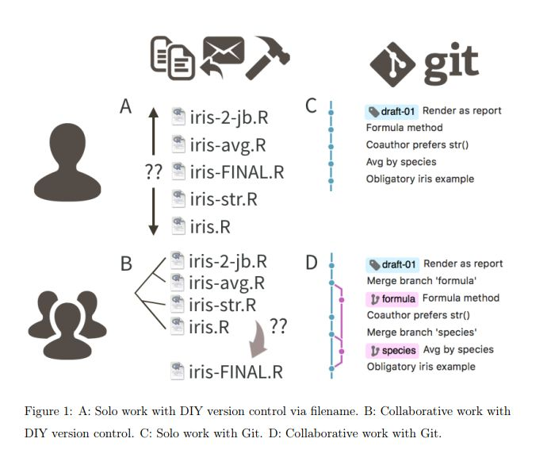
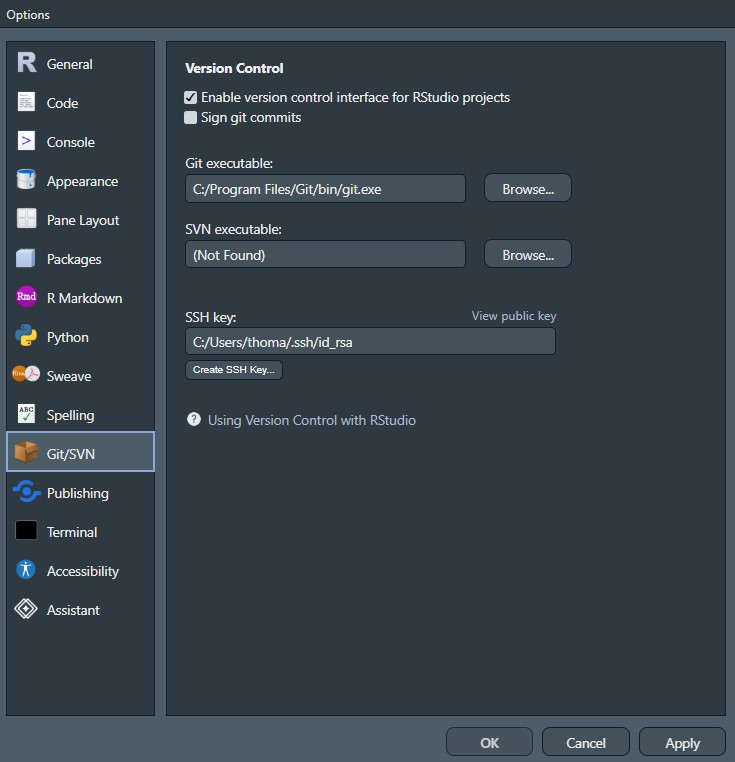
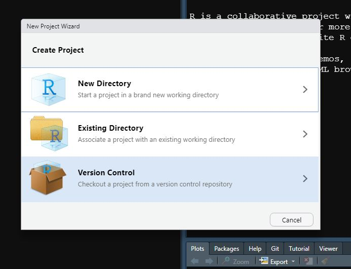
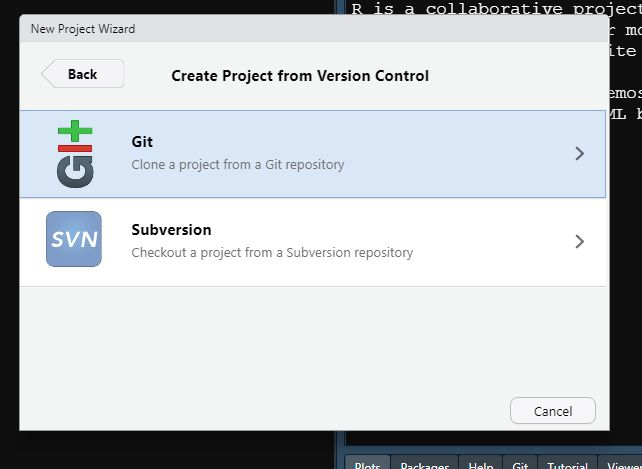
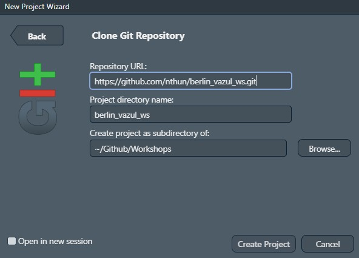
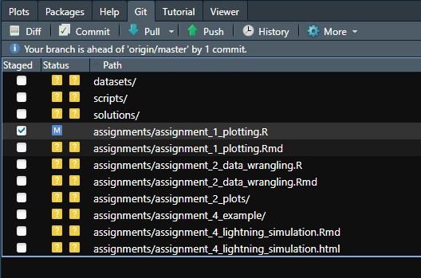

## What this is, and why it matters

Git and GitHub are a version control system: they preserve every version of your
work and let people work on the same thing without overwriting each other.

Versioning is not an optional extra in a data science project. It is the thing
that makes the rest of the day possible — in part 2 you will version a document,
and in part 3 you will send a dataset to a colleague and get their analysis back.

## Bad version control is the academic default

::: {.columns}
::: {.column width="52%"}
Bad practice is common in academia, for data, manuscripts and analysis code
alike. Outdated tools slow the work down, and small misunderstandings turn into
large mistakes.

Nobody sets out to do it badly. The default — saving files with new names —
works well enough right up until it doesn't.
:::
::: {.column width="48%"}
{height="340"}
:::
:::

## {background-color="white"}

::: {.r-fit-text}
article_20190625_final_rev_rev2_final2.docx
:::

## Reasonable practice, by artefact {.smaller}

| | where |
|---|---|
| Preregistration | OSF Registries |
| Data and materials | Zenodo |
| Manuscript | Google Docs, Overleaf |
| **Analysis code** | **GitHub** (GitLab, Codeberg) |

Today is about the last row. The others matter, but code is where version
control pays for itself fastest.

::: {.callout-warning}
## OSF is changing under us

From **16 November 2026** no new OSF projects can be created, and from
**19 February 2027** existing ones become read-only. Registries and Preprints
continue; project file storage does not. Zenodo is the sensible home for data
and materials, and it will mint a DOI for a GitHub release.
:::

## Why this is worth learning

{fig-align="center" height="440"}

::: {style="font-size: 0.6em; text-align: center;"}
A and B: filename-based versioning, alone and in a team. C and D: the same work with git.
Source: [happygitwithr.com](https://happygitwithr.com)
:::

## Two different things

::: {.columns}
::: {.column width="50%"}
### git

A **local** version control system.

Every previous version is kept, but only the current one is in your way.

Built for code and text files: it can show you exactly which lines changed.

Open source.
:::
::: {.column width="50%"}
### GitHub

A **cloud** service built around git.

Where R's own infrastructure lives.

Owned by Microsoft. Public repositories are free, and researchers can get an
academic licence.

Alternatives exist: GitLab, Codeberg, Bitbucket.
:::
:::

## What GitHub gives you

::: {.columns}
::: {.column width="50%"}
- your work is in the cloud and always available
- the version history is public and legible 
- it is built into RStudio
:::
::: {.column width="50%"}
- sharing is a link
- collaborators can suggest changes
- issues, automated testing, a community
:::
:::

{fig-align="center" height="240"}

## The three-step save

Saving to GitHub is three actions, not one.

1. **Save** the file, as you always would. Only your computer knows.
2. **Commit** — tell git this version is worth keeping, with a message saying
   what changed. Still only your computer.
3. **Push** — send it to GitHub.

The middle step is the one that is new. A commit is a *named* version, and the
name is for the person reading it later, usually you.

## Words you will need

::: {.columns}
::: {.column width="60%"}
- **Repository** (repo) — a project. Public by default, can be private.
- **Branch** — a parallel version of the repo. **main** is the default one.
- **Clone** — copy a repo onto your machine.
- **Pull** — fetch changes someone else made.
- **Fork** — copy someone else's repo into your own account.
- **Pull request** — offer your changes to someone else's repo, for them to
  accept.

You will use clone and pull today, and fork and pull request in part 3.
:::
::: {.column width="40%"}
{height="240"}
:::
:::

## How we will use it

Git is usually driven from the command line, and there are good reasons to learn
it that way — but not in 45 minutes.

RStudio has git built in: a pane with buttons for everything we need. We will
use that, and touch the command line only once, to prove it is there.

{fig-align="center" height="260"}

## Setup, in four steps

1. **Install git** — <https://git-scm.com/downloads>
2. **Tell RStudio where it is** — Tools → Global Options → Git/SVN → tick
   *Enable version control interface for RStudio projects*
3. **Register on GitHub** — <https://github.com>
4. **Let git know who you are**, and store a GitHub credential

Let's do it together!

## Enabling git in RStudio

1. Go to Tools/Global options
2. Click Git/SVN
3. Click enable version control interface for RStudio projects
4. The path should fill automatically. If not, restart RStudio!

{fig-align="center" height="480"}

::: {style="font-size: 0.6em; text-align: center;"}
Tools → Global Options → Git/SVN. If the git executable box is empty, point it at your installation.
:::

## Identifying yourself

Every commit is signed with a name and an email. Set them once, from the R
console:

```r
usethis::use_git_config(
  user.name  = "Your Name",
  user.email = "you@example.com"
)
```

Then create a GitHub token and store it:

```r
usethis::create_github_token()   # opens GitHub, copy the token
gitcreds::gitcreds_set()         # paste it here
```

The token is a password for git. Use HTTPS repository URLs and it will be picked
up automatically.

## Practice {background-color="#f0f0f0"}

`exercises/01_git/01a_first_repo.qmd`

We will make a repository on GitHub, open it in RStudio, put something in it,
send it back, and publish it as a web page.

## GitHub first, then RStudio

The order matters. Make the repo on GitHub, *then* bring it down — that way the
connection between the two is set up for you and never has to be repaired.

1. On GitHub: **New repository**, give it a name, tick *Add a README file*
2. Copy the HTTPS URL from the green **Code** button
3. In RStudio: **New Project → Version Control → Git**, paste the URL
4. Done — you have a project that is already connected

## The RStudio project wizard

::: {.columns}
::: {.column width="33%"}

:::
::: {.column width="33%"}

:::
::: {.column width="34%"}

:::
:::


## The Git pane

{fig-align="center" height="400"}

Tick a file to **stage** it, write a message and **Commit**, then **Push**.
**Diff** shows you line-by-line what changed, **History** shows every past
commit, and **Pull** brings down what others have done.

## Publishing: GitHub Pages

Any repo can also be a website, which is how your work becomes something you can
send to someone who does not use git.

On GitHub: **Settings → Pages → Build and deployment → Source: Deploy from a
branch**, then choose branch **main** and folder **/docs**, and Save.

Your site appears at `https://<username>.github.io/<repo>/` within a minute or
two.

We switch it on today with a placeholder. In part 2 your report replaces it.

## Where to read more

- **Happy Git with R** — <https://happygitwithr.com>. The best resource there
  is, and the place to go when something breaks.
- RStudio's own guide to version control:
  [support.posit.co](https://support.posit.co/hc/en-us/articles/200532077)
- **Academic licence** — free GitHub Pro for researchers and doctoral students:
  [docs.github.com](https://docs.github.com/en/education)
- OSF integrates with GitHub, if that fits your workflow.

## Next

Part 2: putting something in that repository worth versioning.
